# MultiplayerShooterGame

**这是一款使用Unreal Engine5.3.2开发的基于steam的多人网络对战游戏**，使用的是listen server的网络模式

**使用到的技术与工具：**

- **OnlineSubsystem**和**OnlineSubsystemSteam**插件--用来处理网络会话
- **EnhancedInput**插件--用来响应用户的交互
- **Anim Blueprint**,**Anim Montage**等动画工具--构建角色的动画系统
- **LagCompensation**（延迟补偿）技术--用来改善玩家的网络体验
- **Niagara**粒子系统--制作一些VFX
- **Gameplay Ability**插件（即GAS）来控制角色的属性（Attributes），如角色的生命值（Health）和护甲值（Shield）；同时还可以用来管理角色类的一些能力，如Fire，Dance等

	​						**Our cute character can dance Hip-Hop now！！！**

## 游戏介绍

**tips：**由于这是基于steam平台的，所以如果想要两人以上通过网络联机游玩。要确保steam开启且在同一个steam region（即下载地区，如下图）

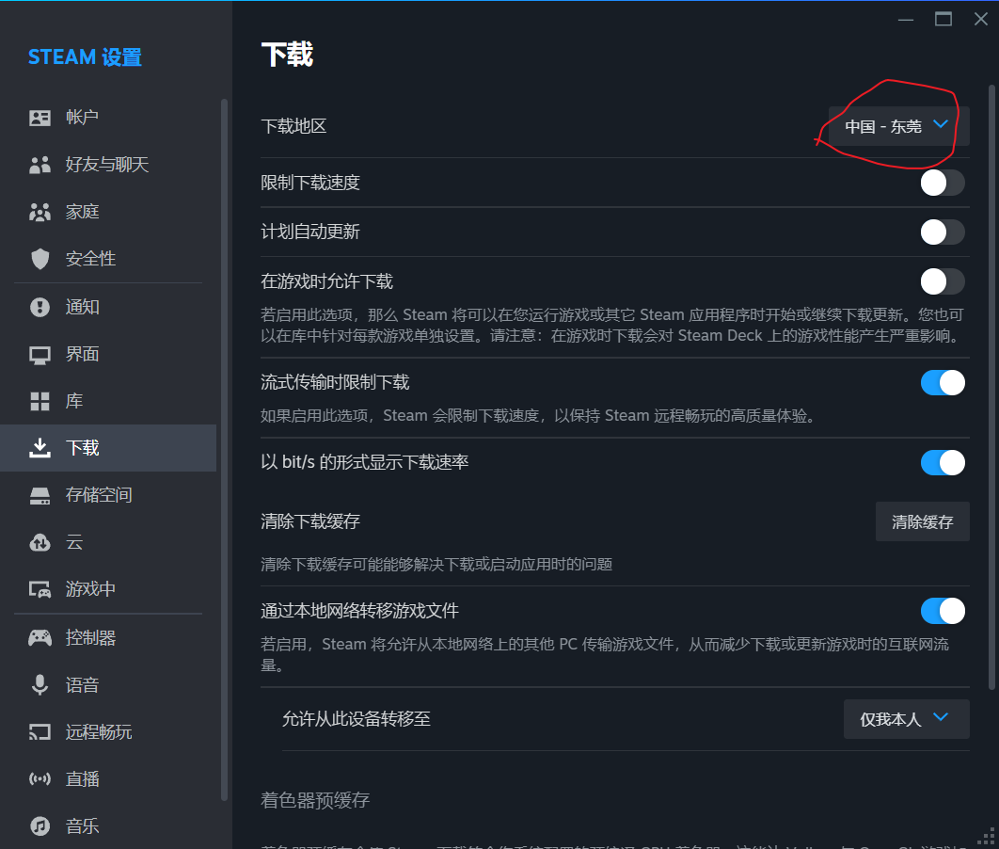

点开打包的可执行文件后，会进入GameStartupMap，即开始界面

在开始界面，房主（player who host the session）可以选择多少人进行游玩和模式,只需房主管理人数和模式，然后创建会话（host），其余玩家直接点击join即可。只要人数达到就可以直接从等候大厅传送到游戏地图

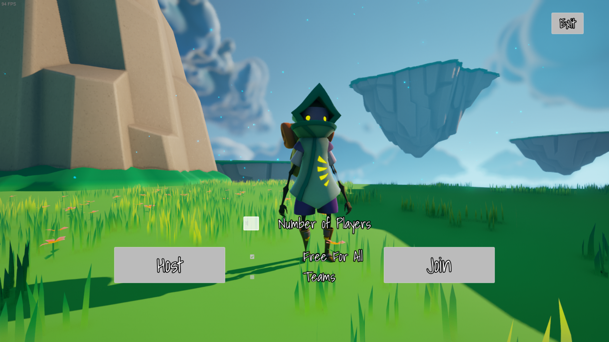

### 模式简介

#### Free For All

这是个人模式，其他人都是敌人，得分最高者获胜

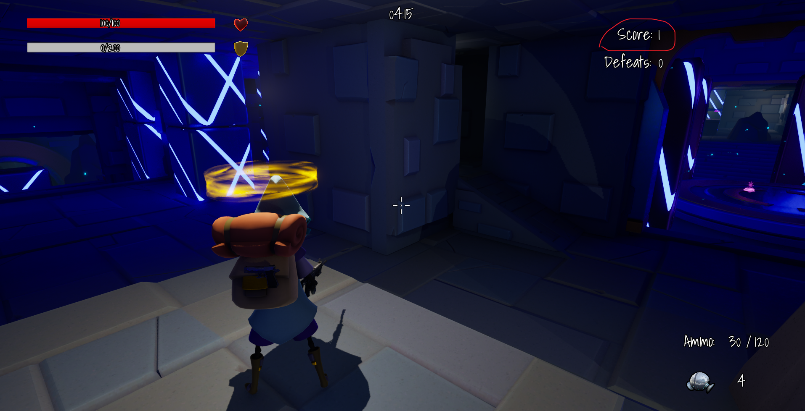

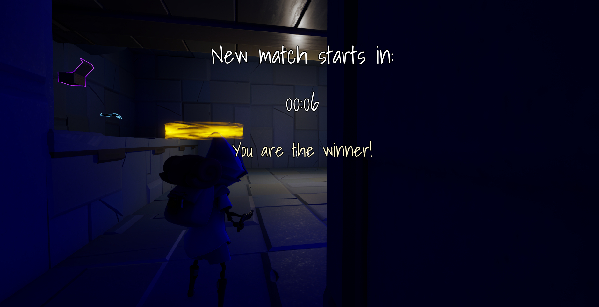

#### Teams

这是团队模式，有两个队伍，Blue team & Red team。可以通过颜色区分。最后按团队分数判断胜负。

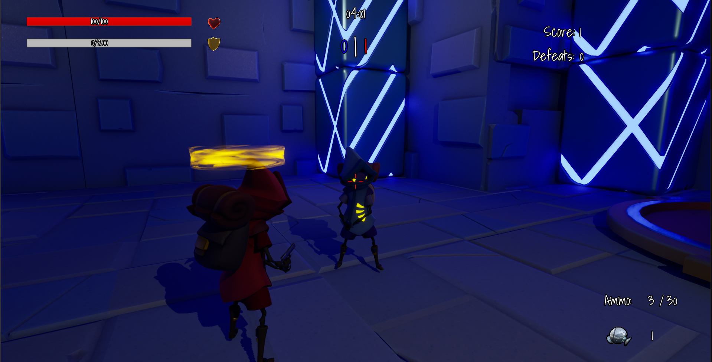

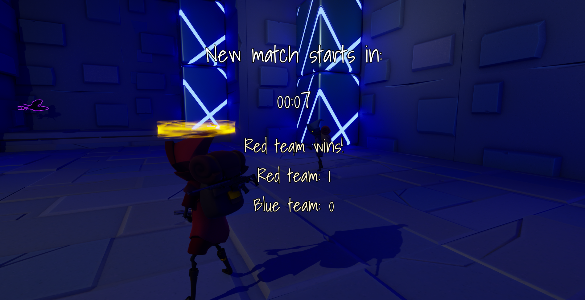

### 内容简介

#### 武器种类

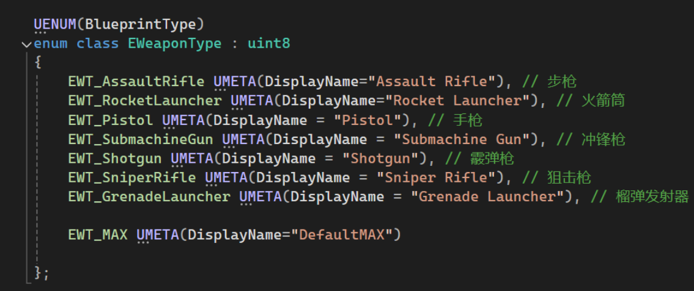

#### Ammos（弹药）

每种武器都有属于他自己的弹药。弹药无法通用。场景布置的时候把适配弹药的出生点放在对应武器旁边了。

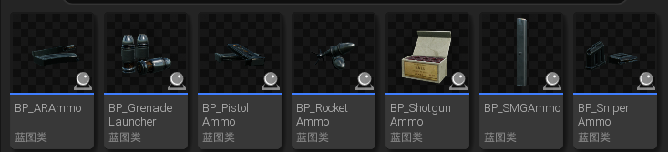

#### Buffs

从左到右

- Speed buff---增加角色的速度
- Health buff---恢复生命值
- Jump buff----增加角色在z方向的速度，即跳得更高了
- Shield buff---护甲值，在受到伤害时，优先消耗护甲值

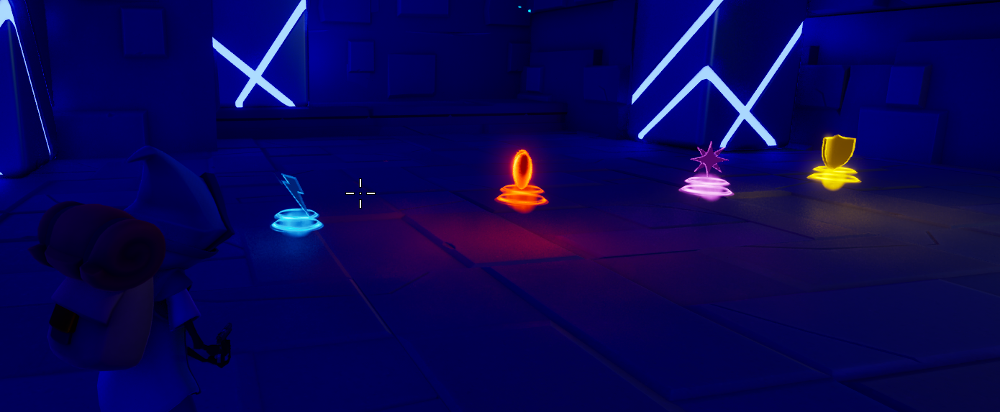

**tips：弹药和buff在被拾取后会在一定时间范围内重新刷新。**

### 操作简介

跟市面上的射击游戏大多数一致，wasd移动，空格跳跃，CTRL下蹲，R装弹，鼠标右键瞄准，左键开火。

说明一下E键，玩家可以拥有两把武器。E键用于捡起武器（优先级最高），也可以用于将背包上的武器与手里的武器进行交换。

T键是扔手雷。ESC是退出游戏（允许中途正常退出）

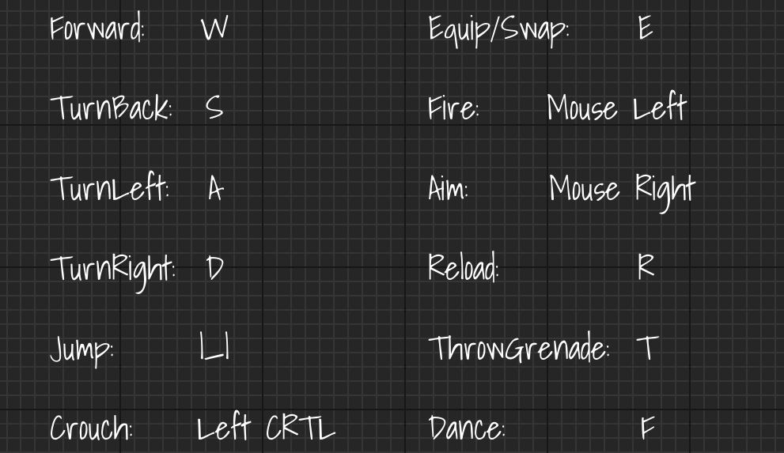

### 一些细节

- 打头双倍伤害。
- 在FreeForAll模式中，玩家的重生算法会让角色在离其他人最远的出生点重生。
- 有些弹药补给点会随机给弹药，而不是一直补给一种类型的弹药。
- Shotgun填装弹药的动画会根据真实的填弹数来播放。比如：如果填装了两个弹药，就播放两次。
- 在比赛倒计时只剩十秒时，倒计时会变红且闪烁。
- 在玩家的网络差到一定程度时，就会出现HighPing Warning，此时为了防止HighPing战神的出现，将不会对这些网络过于差劲的玩家进行server-side rewind。也就是对这些玩家禁用LagCompensation技术。

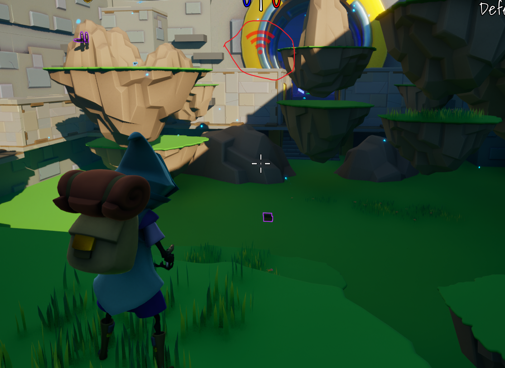

## 实机联机演示视频地址

[UE5多人射击游戏联机演示 (bilibili.com)](https://www.bilibili.com/video/BV1NKYseQEcY/?spm_id_from=333.999.0.0&vd_source=6bb21558c14da4c060df417c22059c6c)